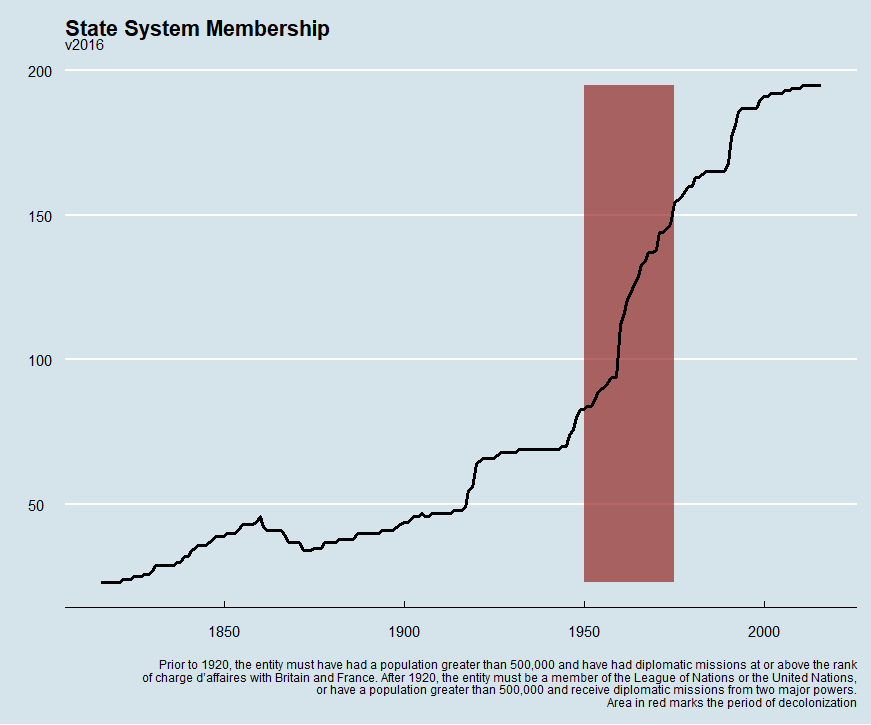
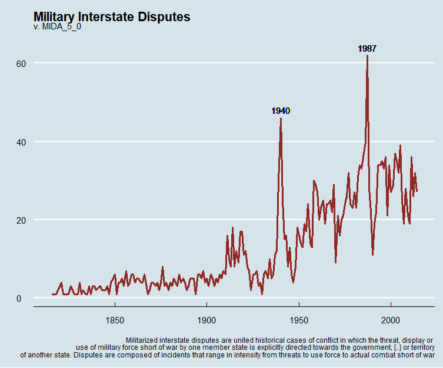
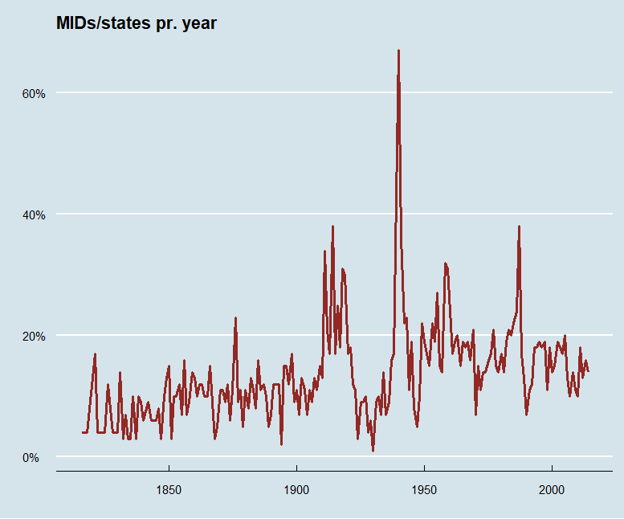
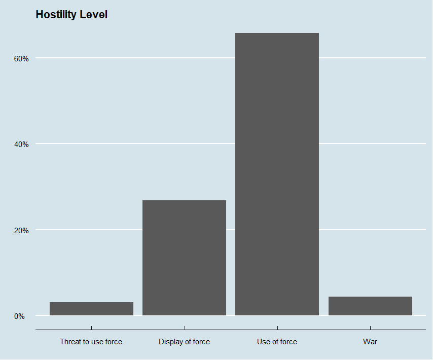
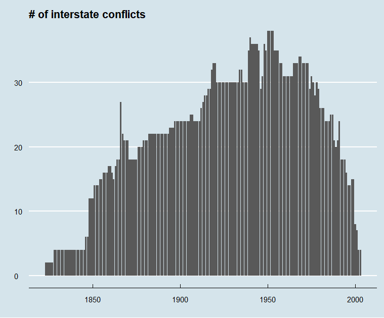
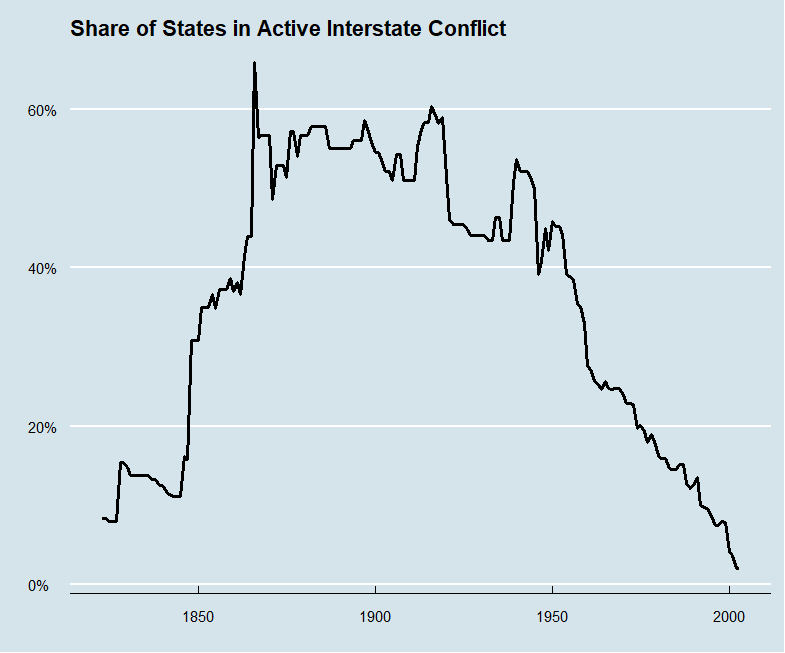

## Correlates of War


A *set* of datasets about international relations and conflict wildly used in research. Contains information on everything from which states exist at a given time to the number of casualties in a given conflict. Most commonly used data is the "MID", or "Militarized Interstate Disputes", defined as:


*“Militarized interstate disputes are united historical cases of conflict in which the threat, display or use of military force short of war by one member state is explicitly directed towards the government, official representatives, official forces, property, or territory of another state. Disputes are composed of incidents that range in intensity from threats to use force to actual combat short of war” (Jones et al. 1996: 163).* 


```{r, include=FALSE}
knitr::opts_chunk$set(eval = FALSE)
```

### Some examples of what we can do with the data

```{r}
library(tidyverse)
library(plm)
library(readr)
states2016 <- read_csv("WarData/Data/states2016.csv")

statesLong <- states2016 %>% 
  pivot_longer(
  c(styear, endyear),
  values_to = "year"
  )


statesLong <- make.pconsecutive(statesLong, index = c("stateabb", "year"))  

statesLong %>% 
  group_by(year) %>% 
  summarise(n_states = n_distinct(stateabb)) %>% 
  ggplot(aes(year, n_states)) + 
  geom_ribbon(aes(xmin = 1950, xmax = 1975), alpha = .7, fill = "#932824") +
  geom_line(size = 1.2) +
  ggthemes::theme_economist() +
  labs(
    title = "State System Membership",
    subtitle = "v2016",
    caption = "Prior to 1920, the entity must have had a population greater than 500,000 and have had diplomatic missions at or above the rank
    of charge d’affaires with Britain and France. After 1920, the entity must be a member of the League of Nations or the United Nations,
    or have a population greater than 500,000 and receive diplomatic missions from two major powers.
    Area in red marks the period of decolonization",
    x = "",
    y = ""
  )


```



```{r}
MIDA_5_0 <- read_csv("WarData/Data/MIDA 5.0.csv")

MIDA_5_0 %>% 
  group_by(styear) %>% 
  summarise(
    n_mid = n_distinct(dispnum),
         ) %>%
  ggplot(aes(styear, n_mid)) +
  geom_line(colour = "#932824", size = 1.2) +
  geom_text(aes(1987, 64, label = "1987")) +
  geom_text(aes(1940, 48, label = "1940")) +
  ggthemes::theme_economist() +
  labs(
    title = "Military Interstate Disputes",
    subtitle = "v. MIDA_5_0",
    x = "",
    y = "",
    caption = "Militarized interstate disputes are united historical cases of conflict in which the threat, display or 
    use of military force short of war by one member state is explicitly directed towards the government, [..] or territory
    of another state. Disputes are composed of incidents that range in intensity from threats to use force to actual combat short of war"
  )

```


```{r}

MidYear <- MIDA_5_0 %>% 
  group_by(year = styear) %>% 
  summarise(
    n_mid = n_distinct(dispnum),
  )

statesYear <- statesLong %>% 
  group_by(year) %>% 
  summarise(n_states = n_distinct(stateabb))


MidYear %>% 
  left_join(statesYear, by = "year") %>% 
  ggplot() +
  geom_line(aes(year, n_mid), size = 1.2) +
  geom_line(aes(year, n_states), size = 1.2) +
  ggthemes::theme_economist() +
  geom_text(aes(2017, 30, label = "Nr. MID"), position = "dodge") +
  geom_text(aes(2018, 195, label = "Nr. States"), position = "dodge")


MidYear %>% 
  left_join(statesYear, by = "year") %>% 
  mutate(mid_rat = n_mid/n_states,
         mid_rat = round(mid_rat, 2)*100) %>% 
  ggplot(aes(year, mid_rat)) +
  geom_line(size = 1.2, colour = "#932824") +
  ggthemes::theme_economist() +
  scale_y_continuous(labels = scales::percent_format(scale = 1)) +
  labs(
    title = "MIDs/states pr. year",
    y = "",
    x = ""
  )

```




```{r}
MIDA_5_0 %>% 
  mutate(
    hostlev_desc = case_when(
      hostlev == 1 ~ "No military action",
      hostlev == 2 ~ "Threat to use force",
      hostlev == 3 ~ "Display of force",
      hostlev == 4 ~ "Use of force",
      hostlev == 5 ~ "War"
    )
  ) %>% 
  mutate(hostlev_desc = fct_relevel(hostlev_desc, c("No military action", "Threat to use force", "Display of force", "Use of force", "War"))) %>% 
  ggplot(aes(hostlev_desc)) +
  geom_bar(aes(y = (..count..)/sum(..count..))) +
  scale_y_continuous(labels = scales::percent_format()) +
  ggthemes::theme_economist() +
  labs(
    title = "Hostility Level",
    x = "",
    y = ""
  )
```





```{r}
Inter_StateWarData <- read_csv("WarData/Data/Inter-StateWarData_v4.0.csv")

Inter_StateWarData %>% 
  select(ccode, StartYear1, EndYear1) %>% 
  pivot_longer(
    c(StartYear1, EndYear1),
    values_to = "year"
  ) %>% 
  make.pconsecutive(., index = c("ccode", "year")) %>% 
  group_by(year) %>% 
  summarise(n_ongoing = n_distinct(ccode)) %>% 
  ggplot(aes(year, n_ongoing)) +
  geom_col() +
  ggthemes::theme_economist() +
  labs(
    title = "# of interstate conflicts",
    y = "",
    x = ""
  )

```




```{r}
Inter_StateWarData %>% 
  select(ccode, StartYear1, EndYear1) %>% 
  pivot_longer(
    c(StartYear1, EndYear1),
    values_to = "year"
  ) %>% 
  make.pconsecutive(., index = c("ccode", "year")) %>% 
  group_by(year) %>% 
  summarise(n_ongoing = n_distinct(ccode)) %>% 
  left_join(statesYear) %>% 
  mutate(inter_rat = n_ongoing/n_states) %>% 
  ggplot(aes(year, inter_rat)) +
  geom_line(size = 1.2) +
  scale_y_continuous(labels = scales::percent_format()) +
  ggthemes::theme_economist() +
  labs(
    title = "Share of States in Active Interstate Conflict",
    x = "",
    y = ""
  )

```




# Civil conflicts, peace data, and more


Setting up a data structure for merging data from different sources

R-Package: 
-          [peacesciencer](https://github.com/svmiller/peacesciencer)
-          [How to use (and cite)](https://svmiller.com/peacesciencer/ms.html)


Using dplyr’s _join functions to merge datasets: https://www.guru99.com/r-dplyr-tutorial.html

Useful war-related datasets to know:

[Uppsala Conflict Data Program (UCDP) data](https://ucdp.uu.se/downloads/)
*          
*          UCDP Georefferenced Event Dataset (GED)
*          UCDP/PRIO Armed Conflict Dataset
*          UCDP Battle-Related Deaths Dataset
*          And many more…


[Stockholm International Peace Research Institute (SIPRI) data](https://www.sipri.org/databases)
        
*          F.ex. SIPRI Military Expenditure Database


[International Peace Institute (IPI) data](https://www.ipinst.org/programs/data-lab)
     
*          IPI Peacekeeping database (data on different levels)
*          F.ex. UN Troop contribution data

Other fun datasets

  [Data on UN and non-UN peacekeeping operations, Bara & Hultman 2020](https://www.corinnebara.net/data)
  
  
  [Peacekeeping mandates dataset PEMA by Di Salvatore et al. 2022](https://sites.google.com/view/pemadata/home)
  
  
  [Replication data for all journal of Peace Research article](https://www.prio.org/journals/jpr/replicationdata)
          
And so many more!

Exercises:

*          Download and look at a few datasets of interest.

*          What are the datastructure? (country-years, mission-months, conflict-years? etc.

*          Join two datasets (you will need to do some data-wrangling to make this possible)


