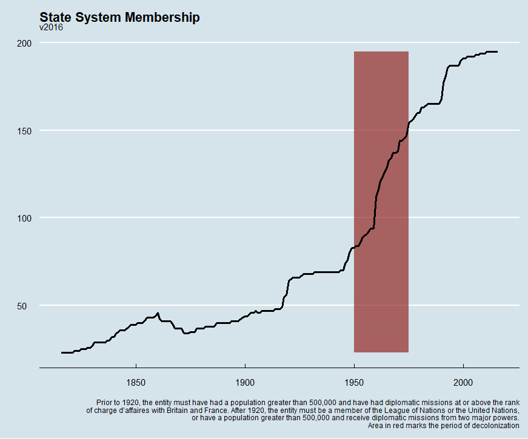
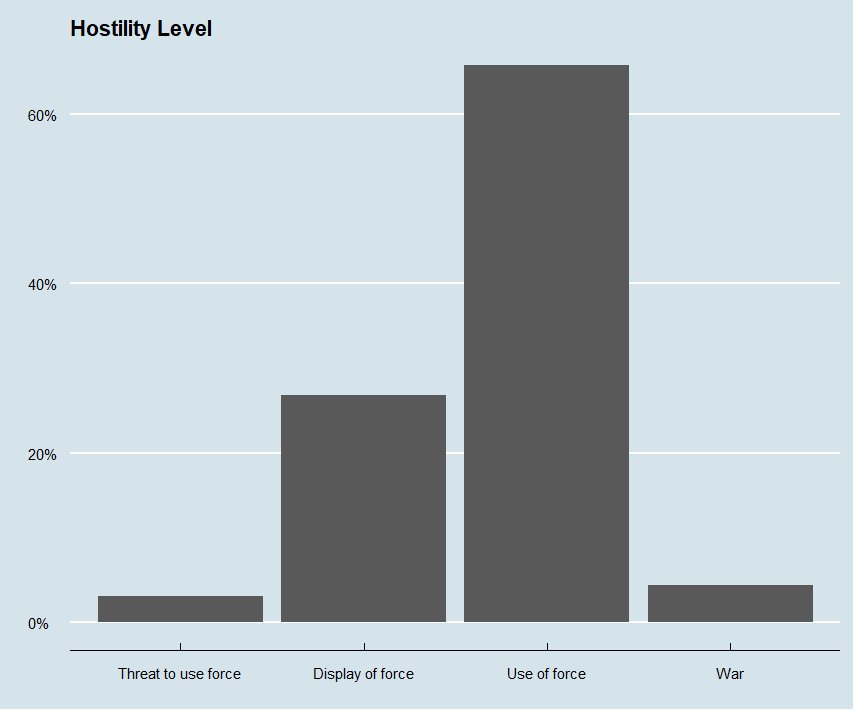
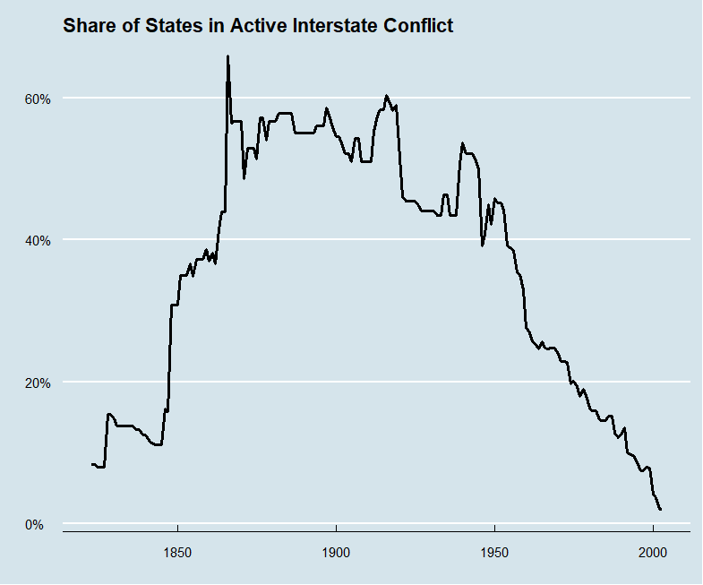
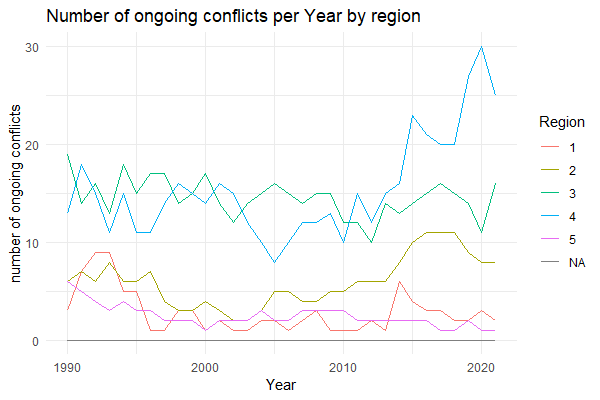

## Correlates of War


A *set* of datasets about international relations and conflict wildly used in research. Contains information on everything from which states exist at a given time to the number of casualties in a given conflict. Most commonly used data is the "MID", or "Militarized Interstate Disputes", defined as:


*“Militarized interstate disputes are united historical cases of conflict in which the threat, display or use of military force short of war by one member state is explicitly directed towards the government, official representatives, official forces, property, or territory of another state. Disputes are composed of incidents that range in intensity from threats to use force to actual combat short of war” (Jones et al. 1996: 163).* 


### Some examples of what we can do with the data


```r
library(tidyverse)
library(plm)
library(readr)
states2016 <- read_csv("WarData/Data/states2016.csv")

statesLong <- states2016 %>% 
  pivot_longer(
  c(styear, endyear),
  values_to = "year"
  )


statesLong <- make.pconsecutive(statesLong, index = c("stateabb", "year"))  

statesLong %>% 
  group_by(year) %>% 
  summarise(n_states = n_distinct(stateabb)) %>% 
  ggplot(aes(year, n_states)) + 
  geom_ribbon(aes(xmin = 1950, xmax = 1975), alpha = .7, fill = "#932824") +
  geom_line(size = 1.2) +
  ggthemes::theme_economist() +
  labs(
    title = "State System Membership",
    subtitle = "v2016",
    caption = "Prior to 1920, the entity must have had a population greater than 500,000 and have had diplomatic missions at or above the rank
    of charge d’affaires with Britain and France. After 1920, the entity must be a member of the League of Nations or the United Nations,
    or have a population greater than 500,000 and receive diplomatic missions from two major powers.
    Area in red marks the period of decolonization",
    x = "",
    y = ""
  )
```




```r
MIDA_5_0 <- read_csv("WarData/Data/MIDA 5.0.csv")

MIDA_5_0 %>% 
  group_by(styear) %>% 
  summarise(
    n_mid = n_distinct(dispnum),
         ) %>%
  ggplot(aes(styear, n_mid)) +
  geom_line(colour = "#932824", size = 1.2) +
  geom_text(aes(1987, 64, label = "1987")) +
  geom_text(aes(1940, 48, label = "1940")) +
  ggthemes::theme_economist() +
  labs(
    title = "Military Interstate Disputes",
    subtitle = "v. MIDA_5_0",
    x = "",
    y = "",
    caption = "Militarized interstate disputes are united historical cases of conflict in which the threat, display or 
    use of military force short of war by one member state is explicitly directed towards the government, [..] or territory
    of another state. Disputes are composed of incidents that range in intensity from threats to use force to actual combat short of war"
  )
```


```r
MidYear <- MIDA_5_0 %>% 
  group_by(year = styear) %>% 
  summarise(
    n_mid = n_distinct(dispnum),
  )

statesYear <- statesLong %>% 
  group_by(year) %>% 
  summarise(n_states = n_distinct(stateabb))


MidYear %>% 
  left_join(statesYear, by = "year") %>% 
  ggplot() +
  geom_line(aes(year, n_mid), size = 1.2) +
  geom_line(aes(year, n_states), size = 1.2) +
  ggthemes::theme_economist() +
  geom_text(aes(2017, 30, label = "Nr. MID"), position = "dodge") +
  geom_text(aes(2018, 195, label = "Nr. States"), position = "dodge")


MidYear %>% 
  left_join(statesYear, by = "year") %>% 
  mutate(mid_rat = n_mid/n_states,
         mid_rat = round(mid_rat, 2)*100) %>% 
  ggplot(aes(year, mid_rat)) +
  geom_line(size = 1.2, colour = "#932824") +
  ggthemes::theme_economist() +
  scale_y_continuous(labels = scales::percent_format(scale = 1)) +
  labs(
    title = "MIDs/states pr. year",
    y = "",
    x = ""
  )
```


```r
MIDA_5_0 %>% 
  mutate(
    hostlev_desc = case_when(
      hostlev == 1 ~ "No military action",
      hostlev == 2 ~ "Threat to use force",
      hostlev == 3 ~ "Display of force",
      hostlev == 4 ~ "Use of force",
      hostlev == 5 ~ "War"
    )
  ) %>% 
  mutate(hostlev_desc = fct_relevel(hostlev_desc, c("No military action", "Threat to use force", "Display of force", "Use of force", "War"))) %>% 
  ggplot(aes(hostlev_desc)) +
  geom_bar(aes(y = (..count..)/sum(..count..))) +
  scale_y_continuous(labels = scales::percent_format()) +
  ggthemes::theme_economist() +
  labs(
    title = "Hostility Level",
    x = "",
    y = ""
  )
```





```r
Inter_StateWarData <- read_csv("WarData/Data/Inter-StateWarData_v4.0.csv")

Inter_StateWarData %>% 
  select(ccode, StartYear1, EndYear1) %>% 
  pivot_longer(
    c(StartYear1, EndYear1),
    values_to = "year"
  ) %>% 
  make.pconsecutive(., index = c("ccode", "year")) %>% 
  group_by(year) %>% 
  summarise(n_ongoing = n_distinct(ccode)) %>% 
  ggplot(aes(year, n_ongoing)) +
  geom_col() +
  ggthemes::theme_economist() +
  labs(
    title = "# of interstate conflicts",
    y = "",
    x = ""
  )
```


```r
Inter_StateWarData %>% 
  select(ccode, StartYear1, EndYear1) %>% 
  pivot_longer(
    c(StartYear1, EndYear1),
    values_to = "year"
  ) %>% 
  make.pconsecutive(., index = c("ccode", "year")) %>% 
  group_by(year) %>% 
  summarise(n_ongoing = n_distinct(ccode)) %>% 
  left_join(statesYear) %>% 
  mutate(inter_rat = n_ongoing/n_states) %>% 
  ggplot(aes(year, inter_rat)) +
  geom_line(size = 1.2) +
  scale_y_continuous(labels = scales::percent_format()) +
  ggthemes::theme_economist() +
  labs(
    title = "Share of States in Active Interstate Conflict",
    x = "",
    y = ""
  )
```




# Civil conflicts, peace data, and more


Setting up a data structure for merging data from different sources

R-Package: 
-          [peacesciencer](https://github.com/svmiller/peacesciencer)
-          [How to use (and cite)](https://svmiller.com/peacesciencer/ms.html)


Using dplyr’s _join functions to merge datasets: https://www.guru99.com/r-dplyr-tutorial.html

Useful war-related datasets to know:

[Uppsala Conflict Data Program (UCDP) data](https://ucdp.uu.se/downloads/)
*          
*          UCDP Georefferenced Event Dataset (GED)
*          UCDP/PRIO Armed Conflict Dataset
*          UCDP Battle-Related Deaths Dataset
*          And many more…


[Stockholm International Peace Research Institute (SIPRI) data](https://www.sipri.org/databases)
        
*          F.ex. SIPRI Military Expenditure Database


[International Peace Institute (IPI) data](https://www.ipinst.org/programs/data-lab)
     
*          IPI Peacekeeping database (data on different levels)
*          F.ex. UN Troop contribution data

Other fun datasets

  [Data on UN and non-UN peacekeeping operations, Bara & Hultman 2020](https://www.corinnebara.net/data)
  
  
  [Peacekeeping mandates dataset PEMA by Di Salvatore et al. 2022](https://sites.google.com/view/pemadata/home)
  
  
  [Replication data for all journal of Peace Research article](https://www.prio.org/journals/jpr/replicationdata)
          
And so many more!

Exercises:

*          Download and look at a few datasets of interest.

*          What are the datastructure? (country-years, mission-months, conflict-years? etc.

*          Join two datasets (you will need to do some data-wrangling to make this possible)


```r
## Coffee and Coding topic:war data##
#Sverke R. Saxegaard
#10.11.22

#the purpose of this script is to show how one might use peacesciencer and r to combine data from different sources.

#packages used in this script
library(tidyverse)
library(dplyr)
library(readr)
library(ggplot2)
library(lubridate)
library(readxl)

#UCDP data
ucdp_e <- read_csv("R_projects/GEDEvent_v22_1.csv")
View(ucdp_e)

ucdp_c <- read_csv("R_projects/ucdp-prio-acd-221.csv")
View(ucdp_c)

ucdp_bd <- read_csv("R_projects/ucdp-brd-conf-221.csv")
View(ucdp_bd)

#SIPRI data
#military expenditure per country (in constant 2020 USD)
sipri_me <- read_excel("R_projects/sipri_me9021.xls")
View(sipri_me)


#IPI data
#troop contributing countries, monthly
ipi_tcc <- read_csv("R_projects/data_tcc.csv")
View(ipi_tcc)


#set up your own data with data from these sources?
#by using the package peacesciencer
#install.packages("peacesciencer")

library(peacesciencer)

#enables us to amke an empty panel data that we can fill with data from various sources

data<- create_stateyears(system = "gw") %>%
  filter(year %in% c(1990:2021))
view(data)

#peacesciencer have few built in datasets (f.ex ucdp armed conflicts and some democracy metrics)

data <- create_stateyears(system = "gw") %>%
  filter(year %in% c(1990:2021))%>%
  add_ucdp_acd ()%>%
  add_democracy()
#problem: only updated to 2019 :( 

#lets try to do it manually (big task!)

#doing some joins with dplyr
?anti_join #shows you the observations 
?left_join #keeps all observation in first dataset, and matching observations from second dataset
?full_join #keeps all observations from both datasets
?inner_join #keeps only observations which are present in both datasets

#create an empty panel:

data<- create_stateyears(system = "gw") %>%
  filter(year %in% c(1990:2021))

#first, conflict data
#lets limit ourselves to intrastate wars

ucdp_c1 <- ucdp_c%>%
  select(conflict_id, location, year, side_a_2nd, side_b, side_b_2nd, intensity_level, type_of_conflict, region, gwno_a)%>%
  filter(type_of_conflict> 2, year > 1989)%>%
  mutate(gwcode = as.numeric(gwno_a))

anti_join(data, ucdp_c1, by = c("gwcode", "year"))
# a lot of country-years do not have conflicts, not surprising
anti_join(ucdp_c1, data, by = c("gwcode", "year"))
#all conflicts found a country year to match to, great!

#joing!
data1 <- left_join(data, ucdp_c1, by = c("gwcode", "year"))
view(data1)
#problem! Some country-years show up multiple times because some country years have multiple conflicts!!
#what to do?
#(easy solution is to download a dataset with the correct datastructure)
#but let us try the hard solution

#making a variable that counts the number of observations per country year
ndata <- data1%>%
  group_by(gwcode, year)%>%
  count()

#joining the new variable to the datset
data2<-
  left_join(data1, ndata, by = c("gwcode", "year"))

#making new variables which will be the same for all instances of a unique country-year
data3<- data2%>%
  group_by(gwcode, year)%>%
  mutate(side_b_list = list(side_b))%>%
  mutate(side_a_2nd_list = list(side_a_2nd))%>%
  mutate(side_b_2nd_list = list(side_b_2nd))%>%
  mutate(intensity_level_new = max(intensity_level))%>%
  mutate(conflict_id_list = list(conflict_id))%>%
  mutate(type_of_conflict_new = max(type_of_conflict))%>%
  ungroup()%>%
  mutate(ongoing_conflicts = ifelse(is.na(data2$region), 0, n))%>%
  group_by(gwcode)%>%
  mutate(region_new = max(region, na.rm = TRUE))


view(data3)
#looks good! now lets get rid of the duplicates

#making a new dataset with only the new variables
data4 <- data3%>%
  select(-c(side_b, side_a_2nd,side_b_2nd, intensity_level, conflict_id, type_of_conflict, region))

data5 <- unique(data4)
#notice that data5 has exactly 5477 obs!

#lets add a separate variable that counts the number of conflicts starting and ending

data6 <- data5%>%
  group_by(gwcode)%>%
  arrange(year)%>%
  mutate(L1_ongoing_conflicts = dplyr::lag(ongoing_conflicts,1))%>%
  mutate(change = ongoing_conflicts - L1_ongoing_conflicts)


#some simple plots

data6%>%
  group_by(year)%>%
  mutate(cf = sum(ongoing_conflicts))%>%
  ggplot()+
  geom_line(aes(x= year, y= cf))+
  labs(y= "Number of ongoing conflicts",
       x = "Year",
       title = "Number of ongoing conflicts per Year")+
  theme_minimal()
```


```r
data6%>%
  group_by(year, region_new)%>%
  mutate(cf = sum(ongoing_conflicts))%>%
  ggplot()+
  geom_line(aes(x= year, y= cf, color = region_new))+
  labs(y= "number of ongoing conflicts",
       x = "Year",
       title = "Number of ongoing conflicts per Year by region",
       color = "Region")+
  theme_minimal()
```



```r
#second, military expenditure

view(sipri_me)

#ahh so we have data for each country year, but we do not have gwcode, and the data is in a different structure. Let us see what we can do

#changing the structure of the data
sipri2 <- sipri_me%>%
  pivot_longer(cols = c("1990":"2021"),
               names_to = "year",
               values_to = "mil_exp")
view(sipri2) #success!

#trying to merge...
#first, making sure we have variables to match with
sipri3<- sipri2%>%
  mutate(statename = Country)%>%
  mutate(year = as.numeric(year))

anti_join (data6, sipri3, by = c("statename", "year"))

#oh wow, 34 countries with dissimilar names...

testdata <- anti_join (data6, sipri3, by = c("statename", "year"))
view(testdata)
list<- testdata%>%
  count(statename)
print(list, n =34)
view(sipri3)

#some of these are not included in SIPRIs data because they are too small (Bahamas, Barbados, Solomon Islands)
#the rest just have different names...
#there is probably as clever way to do this...
#f.ex the country code package (countrycode)
#But I am not that clever right now, so lets do it manually

sipri4<- sipri3%>%
  mutate(statename = case_when(
    statename == "Germany" ~ "German Federal Republic",
    statename == "Italy" ~ "Italy/Sardinia",
    statename == "Romania"~"Rumania",
    statename == "USSR" & year < 1991 ~"Russia (Soviet Union)",
    statename == "Russia" & year > 1991 ~"Russia (Soviet Union)",
    statename == "Gambia, The"~"Gambia",
    statename == "Cote d'Ivoire" ~"Cote D'Ivoire",
    statename == "Burkina Faso"~"Burkina Faso (Upper Volta)",
    statename == "Congo, Republic"~"Congo",
    statename == "Congo, DR"~"Congo, Democratic Republic of (Zaire)",
    statename == "Tanzania" ~"Tanzania/Tanganyika",
    statename == "Zimbabwe" ~ "Zimbabwe (Rhodesia)",
    statename == "Eswatini" ~"Swaziland",
    statename == "Iran"~"Iran (Persia)",
    statename == "Turkey"~"Turkey (Ottoman Empire)",
    statename == "Yemen" ~"Yemen (Arab Republic of Yemen)",
    statename == "Korea, North" ~"Korea, People's Republic of",
    statename == "Korea, South" ~"Korea, Republic of",
    statename == "Myanmar"~"Myanmar (Burma)",
    statename == "Sri Lanka"~"Sri Lanka (Ceylon)",
    statename == "Cambodia"~"Cambodia (Kampuchea)",
    statename == "Viet Nam" ~"Vietnam, Democratic Republic of",
    statename == "North Macedonia"~"Macedonia (Former Yugoslav Republic of)",
    statename == "Belarus"~"Belarus (Byelorussia)",
    statename == "Bosnia and Herzegovina"~"Bosnia-Herzegovina",
    statename == "Czechia"~"Czech Republic",
    statename == "Timor Leste"~"East Timor",
    TRUE~ statename))


#did it work?

testdata <- anti_join (data6, sipri4, by = c("statename", "year"))
list<- testdata%>%
  count(statename)
print(list, n =34)

#acceptable
#lets do the proper merge

data7 <- left_join(data6, sipri4,by = c("statename", "year"))
view(data7)
str(data7)
#looks good! (except some variables really should not be charachter, but numbers)

data7b<- data7%>%
  ungroup()%>%
  mutate(mil_exp = as.numeric(mil_exp),
         region = as.numeric(region_new))
view(data7b)
str(data7b)
#looks good!

#third, troop contribution

view(ipi_tcc) # okay what do we have here? Looks like monthly data

#then lets bring out the 'lubridate' package

ipi_tcc$date <- as.POSIXct(ipi_tcc2$Date, format = "%Y-%m-%d ") #making r understand the Date variable is actually a date
ipi_tcc$year <- as.numeric(format(ipi_tcc2$date, format="%Y"))#extracting the year 


#making new variables on a yearly level
ipi_tcc2 <- ipi_tcc%>%
  group_by(year, Contributor)%>%
  mutate(missions = max(`Number of Missions Contributed To`),
         meantroops = mean(Troops),
         meanpolice = mean(Civilian_Police),
         meanobservers = mean(Observers),
         meantotal = mean(Total))

ipi_tcc2<- ipi_tcc2%>%
  mutate(statename = Contributor)

#keeping only the variables on yearly level (aka making a lot of duplicates)
ipi_tcc3 <- ipi_tcc2%>%
  ungroup()%>%
  select(statename, year, missions, meantroops, meanpolice, meanobservers, meantotal)

#removing the duplicates

ipi_tcc4<- unique(ipi_tcc3)
view(ipi_tcc4)

#looks good!
#time to merge

#First, what observations in ipi_tcc4 does not exist in data7??
testdata <- anti_join (ipi_tcc4, data7b, by = c("statename", "year"))
list<- testdata%>%
  count(statename)
print(list, n =200)

#ahhh, we know this problem right?
#note the subtle differences from last case_when code...
ipi_tcc5<- ipi_tcc4%>%
  mutate(statename = case_when(
    statename == "Germany" ~ "German Federal Republic",
    statename == "Italy" ~ "Italy/Sardinia",
    statename == "Romania"~"Rumania",
    statename == "Russian Federation"~"Russia (Soviet Union)",
    statename == "Gambia, The"~"Gambia",
    statename == "Cote d Ivoire" ~"Cote D'Ivoire", 
    statename == "Burkina Faso"~"Burkina Faso (Upper Volta)",
    statename == "Congo, Republic"~"Congo",
    statename == "DR Congo"~"Congo, Democratic Republic of (Zaire)",
    statename == "Tanzania" ~"Tanzania/Tanganyika",
    statename == "Zimbabwe" ~ "Zimbabwe (Rhodesia)",
    statename == "Eswatini" ~"Swaziland",
    statename == "Iran"~"Iran (Persia)",
    statename == "Turkey"~"Turkey (Ottoman Empire)",
    statename == "Yemen" ~"Yemen (Arab Republic of Yemen)",
    statename == "Korea, North" ~"Korea, People's Republic of",
    statename == "Republic of Korea" ~"Korea, Republic of",
    statename == "Myanmar"~"Myanmar (Burma)",
    statename == "Sri Lanka"~"Sri Lanka (Ceylon)",
    statename == "Cambodia"~"Cambodia (Kampuchea)",
    statename == "Vietnam" ~"Vietnam, Democratic Republic of",
    statename == "Macedonia"~"Macedonia (Former Yugoslav Republic of)",
    statename == "The former Yugoslav Republic of Macedonia"~"Macedonia (Former Yugoslav Republic of)",
    statename == "Belarus"~"Belarus (Byelorussia)",
    statename == "Bosnia and Herzegovina"~"Bosnia-Herzegovina",
    statename == "Timor Leste"~"East Timor",
    statename == "Kyrgyzstan"~"Kyrgyz Republic",
    TRUE~ statename))

testdata <- anti_join (ipi_tcc5, data7b, by = c("statename", "year"))
list<- testdata%>%
  count(statename)
print(list, n =200)

#still some issues, but i do not have time to fix that now...

#lets do the merge!!!

data8 <- left_join(data7b, ipi_tcc5, by = c("statename", "year"))
view(data8)

#FINALY!
#now we have a dataset with data on intrastate conflict, military expenditure and troop contribution
#anything we would like to find out?

#lets remove all the datasets and objects we are no longer using
rm(list=setdiff(ls(), "data8"))
```

### Models


```r
#basic ols
model1 <- lm (meantroops~mil_exp, data = data8)
summary(model1)  

#no effect

model2 <- lm (meantroops~mil_exp+ongoing_conflicts, data = data8)
summary(model2)

#more civil wars = more troops contributed!

data8%>%
  ggplot()+
  geom_point(aes(mil_exp, meantroops))+
  theme_minimal()

data8%>%
  ggplot()+
  geom_point(aes(meantroops, ongoing_conflicts))+
  theme_minimal()

#lets add some country-fixed effects to see if more conflicts and more military expenditure leads to more troops contribution within single countries
library(fixest)

model3<-feols(meantroops ~ mil_exp + ongoing_conflicts | statename, cluster = "statename", data = data8)
summary(model3)

#with fixed effects: more conflicts = less troops contributed
```


